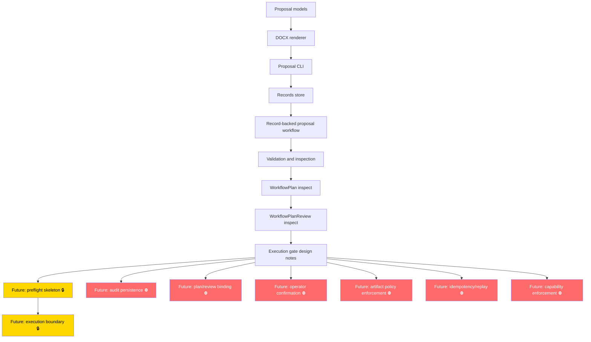

# Phoenix Office Development Progress Dashboard

> **Phoenix Office still cannot execute orchestration plans.**
> All execution, preflight, enforcement, audit persistence, and automation gates remain unimplemented.
> This dashboard reflects verified progress through PR #97.

---

## 1. Current Status Summary

| Capability | Status |
|---|---|
| Proposal DOCX generation | ✅ Complete |
| Record-backed proposal workflow | ✅ Complete |
| Validation / inspection CLI | ✅ Complete |
| WorkflowPlan inspect | ✅ Complete |
| WorkflowPlanReview inspect | ✅ Complete |
| Orchestration execution gate design docs | 🟡 Designed / documented |
| Execution implementation | ⛔ Not implemented |
| Audit persistence | ⛔ Not implemented |
| Plan / review binding enforcement | ⛔ Not implemented |
| Validation / preflight enforcement | ⛔ Not implemented |
| Operator confirmation enforcement | ⛔ Not implemented |
| Output / artifact policy enforcement | ⛔ Not implemented |

**Status key:**
- ✅ Complete — implemented, tested, merged
- 🟡 Designed / documented — design notes exist; no runtime behavior
- 🔒 Guarded / intentionally blocked — blocked pending explicit approval
- ⛔ Not implemented — not started

---

## 2. Capability Maturity Table

| Area | Current state | Evidence / source docs | Next likely step |
|---|---|---|---|
| Proposal generation | Complete — DOCX output from JSON records | `src/phoenix_office/renderers/`, `src/phoenix_office/generators/`, PR #2–#7 | Stable; no changes planned |
| Record storage / import / export | Complete — SQLite-backed `RecordStore` with CLI | `src/phoenix_office/records/`, `docs/development/records_cli.md`, PR #29–#41 | Stable |
| Proposal validation / inspection | Complete — `validate` and `inspect` CLI for `ProposalInput` and `RecordProposalDetails` | `docs/development/proposal_workflow_runbook.md`, PR #49–#55 | Stable |
| WorkflowPlan inspection | Complete — read-only `orchestration plan inspect` CLI | `docs/development/orchestration_inspection_cli.md`, PR #72 | Stable |
| WorkflowPlanReview inspection | Complete — read-only `orchestration review inspect` CLI | `docs/development/orchestration_inspection_cli.md`, PR #74 | Stable |
| Orchestration execution gates | Design notes only — 13 documented gate areas, none implemented | `docs/development/orchestration_execution_readiness_checklist.md`, PR #85–#97 | Preflight skeleton (Lane C, future) |
| Future preflight | ⛔ Not implemented | `docs/development/orchestration_validation_preflight_design_notes.md` | Skeleton only, when explicitly approved |
| Future execution | ⛔ Not implemented | `docs/development/orchestration_execution_command_surface_design_notes.md` | Requires all gates cleared |
| Future audit persistence | ⛔ Not implemented | `docs/development/orchestration_audit_logging_design_notes.md` | Skeleton only, when explicitly approved |
| Future API / MCP surfaces | ⛔ Not implemented | `docs/prd/ecosystem-informed-prd.md` | After execution boundary is stable |

---

## 3. Mermaid Roadmap Diagram

> Gold (🔒) = guarded / blocked pending explicit approval.
> Red (⛔) = not implemented, no design finalized for implementation.

---

## 4. PR Milestone Timeline

| Phase | PRs | Summary |
|---|---|---|
| Foundation | #2–#7 | Proposal data model, DOCX renderer, A-1 fixture, CI workflow, proposal CLI |
| Phoenix architecture / contracts | #16–#28 | Architecture docs, Core contracts, capability registry, `TaskEnvelope`, JSON examples, PR/issue templates, read-only capability/envelope CLIs |
| Records layer | #29–#41 | `CustomerRecord`/`JobRecord` models, SQLite `RecordStore`, JSON codecs/fixtures, import/list/show/export CLI |
| Record-backed proposal workflow | #42–#59 | Record-to-`ProposalInput` adapter, compose/validate/inspect CLI, smoke tests, runbook, operator checklist, output artifact conventions, MVP acceptance doc |
| Orchestration contracts and inspection | #60–#84 | `WorkflowPlan` model + fixture, approval boundary + fixtures, project state/runbook/guardrails docs, `WorkflowPlan` inspect CLI, `WorkflowPlanReview` inspect CLI, inspection guide, CLI help/path/non-execution tests, next-brick planning guide |
| Execution readiness and guardrail docs | #85–#97 | Execution readiness checklist, 12 design-notes-only gate areas (audit, binding, preflight, confirmation, artifact policy, dry-run, result, command surface, cancellation, provenance, private data/secrets, permission/capability, idempotency/replay) |

---

## 5. Current Guardrails

The following are explicitly **not implemented**:

- **Planning and approval contracts are non-executing.** They describe and record decisions; they do not trigger any action.
- **Phoenix Office cannot execute orchestration plans.** No execution path exists.
- **No audit persistence exists.**
- **No plan / review binding enforcement exists.**
- **No validation / preflight enforcement exists.**
- **No operator confirmation enforcement exists.**
- **No output / artifact policy enforcement exists.**
- **No dry-run / no-write enforcement exists.**
- **No execution result reporting exists.**
- **No cancellation or rollback behavior exists.**
- **No input provenance enforcement exists.**
- **No private-data / secrets enforcement exists.**
- **No permission / capability enforcement exists.**
- **No idempotency / replay behavior exists.**

---

## 6. Next Work Lanes

### Lane A — docs / manual (safe for this agent now)

- [x] Progress dashboard (this document)
- [ ] Documentation cleanup and navigation updates
- [ ] Project state updates after future merged PRs

### Lane B — tests (should wait for Codex or careful local work)

- [ ] Unsupported command-surface guard tests for new gate areas
- [ ] Path / error handling tests for edge cases
- [ ] Preflight contract tests (when preflight implementation is approved)

### Lane C — implementation (should wait for Codex or careful local work)

- [ ] Preflight skeleton
- [ ] Plan / review binding skeleton
- [ ] Operator confirmation skeleton
- [ ] Audit persistence skeleton

> ⚠️ **Lane B and Lane C should not be started without explicit scoped approval.** Do not implement, automate, or enforce anything in these lanes without a dedicated task prompt.
