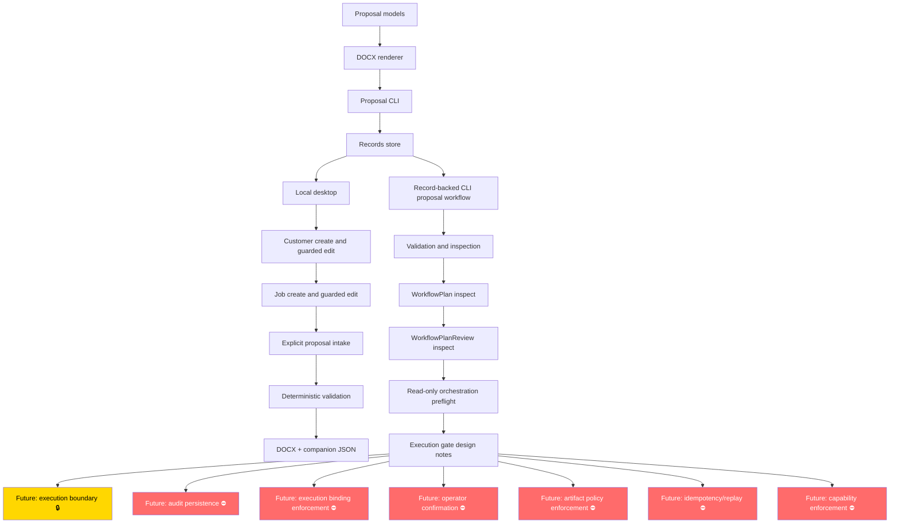

# Phoenix Office Development Progress Dashboard

> **Phoenix Office still cannot execute orchestration plans.**
> Orchestration execution, mutation, audit persistence, scheduling, retries, and automatic delivery remain unavailable.
> Read-only inspection and preflight capabilities remain non-executing.
> A separate supervised Codex worker-edit path is verified through PR #372 and TASK-064, with Phoenix retaining every repository and review boundary.
> This dashboard reflects verified progress through PR #372 and TASK-064.

---

## 1. Current Status Summary

| Capability | Status |
|---|---|
| Local desktop proposal workflow | ✅ Complete |
| Customer creation | ✅ Complete — insert-only |
| Customer guarded editing | ✅ Complete — immutable ID and stale-data protection |
| Job creation | ✅ Complete — insert-only for the selected customer |
| Job guarded editing | ✅ Complete — immutable IDs, fixed customer association, stale-data protection |
| Desktop DOCX + companion JSON generation | ✅ Complete — deliberate explicit action |
| CLI proposal DOCX generation | ✅ Complete |
| Record-backed CLI proposal workflow | ✅ Complete |
| Validation / inspection CLI | ✅ Complete |
| WorkflowPlan inspect | ✅ Complete |
| WorkflowPlanReview inspect | ✅ Complete |
| Read-only orchestration preflight | ✅ Complete — non-executing |
| Supervised Codex worker edits | ✅ Verified — isolated WSL2/Linux worker; Phoenix-controlled validation and delivery |
| Orchestration execution gate design docs | 🟡 Designed / documented |
| Execution implementation | ⛔ Not implemented |
| Audit persistence | ⛔ Not implemented |
| Plan / review binding enforcement | ⛔ Not implemented |
| Validation / preflight enforcement | ⛔ Not implemented |
| Operator confirmation enforcement | ⛔ Not implemented |
| Output / artifact policy enforcement | ⛔ Not implemented |

**Status key:**
- ✅ Complete — implemented, tested, merged
- 🟡 Designed / documented — design notes exist; no runtime behavior
- 🔒 Guarded / intentionally blocked — blocked pending explicit approval
- ⛔ Not implemented — not started

---

## 2. Capability Maturity Table

| Area | Current state | Evidence / source docs | Next likely step |
|---|---|---|---|
| Local desktop proposal workflow | Complete — explicit records and proposal details, deterministic validation, DOCX + companion JSON generation | `src/phoenix_office/proposal_desktop.py`, PR #347, PR #349, PR #350 | Stable; no successor implied |
| Desktop customer records | Complete within current authority — insert-only creation and guarded editing; no delete or ID rename | `src/phoenix_office/records/`, PR #352, PR #356 | Stable within current authority |
| Desktop job records | Complete within current authority — selected-customer insert-only creation and guarded editing; no delete, ID rename, or reassignment | `src/phoenix_office/records/`, PR #354, PR #358 | Stable within current authority |
| CLI proposal generation | Complete — DOCX output from JSON records | `src/phoenix_office/renderers/`, `src/phoenix_office/generators/`, PR #2–#7 | Stable; no changes planned |
| Record storage / import / export | Complete — SQLite-backed `RecordStore` with CLI | `src/phoenix_office/records/`, `docs/development/records_cli.md`, PR #29–#41 | Stable |
| Proposal validation / inspection | Complete — `validate` and `inspect` CLI for `ProposalInput` and `RecordProposalDetails` | `docs/development/proposal_workflow_runbook.md`, PR #49–#55 | Stable |
| WorkflowPlan inspection | Complete — read-only `orchestration plan inspect` CLI | `docs/development/orchestration_inspection_cli.md`, PR #72 | Stable |
| WorkflowPlanReview inspection | Complete — read-only `orchestration review inspect` CLI | `docs/development/orchestration_inspection_cli.md`, PR #74 | Stable |
| Read-only orchestration preflight | Complete — deterministic non-executing reports and plan/review fingerprint checks | `docs/development/orchestration-preflight-json-contract.md`, PR #134–#139 | Stable; remains non-executing |
| Supervised Codex worker edits | Verified through PR #372 and TASK-064 — durable claim/control state, supervised execution-to-PR foundation, authenticated model transport, isolated WSL2/Linux execution, validated patch transfer, and targeted cancellation/exit proof | TASK-059–TASK-062, TASK-064, PR #372 | Phoenix retains validation, commit, push, PR, review, and merge authority |
| Orchestration execution gates | Design notes and read-only preflight only — execution remains unavailable | `docs/development/orchestration_execution_readiness_checklist.md`, PR #85–#97, PR #134–#139 | No execution work authorized |
| Future execution | ⛔ Not implemented | `docs/development/orchestration_execution_command_surface_design_notes.md` | Requires all gates cleared |
| Future audit persistence | ⛔ Not implemented | `docs/development/orchestration_audit_logging_design_notes.md` | Skeleton only, when explicitly approved |
| Future API / MCP surfaces | ⛔ Not implemented | `docs/prd/ecosystem-informed-prd.md` | After execution boundary is stable |

---

## 3. Mermaid Roadmap Diagram

```mermaid
flowchart TD
    A[Proposal models] --> B[DOCX renderer]
    B --> C[Proposal CLI]
    C --> D[Records store]
    D --> E[Record-backed CLI proposal workflow]
    E --> F[Validation and inspection]

    D --> R[Local desktop]
    R --> S[Customer create and guarded edit]
    S --> T[Job create and guarded edit]
    T --> U[Explicit proposal intake]
    U --> V[Deterministic validation]
    V --> W[DOCX + companion JSON]

    F --> G[WorkflowPlan inspect]
    G --> H[WorkflowPlanReview inspect]
    H --> I[Read-only orchestration preflight]
    I --> J[Execution gate design notes]
    J --> K[Future: execution boundary 🔒]

    J --> L[Future: audit persistence ⛔]
    J --> M[Future: execution binding enforcement ⛔]
    J --> N[Future: operator confirmation ⛔]
    J --> O[Future: artifact policy enforcement ⛔]
    J --> P[Future: idempotency/replay ⛔]
    J --> Q[Future: capability enforcement ⛔]

    style K fill:#ffd700,color:#000
    style L fill:#ff6b6b,color:#fff
    style M fill:#ff6b6b,color:#fff
    style N fill:#ff6b6b,color:#fff
    style O fill:#ff6b6b,color:#fff
    style P fill:#ff6b6b,color:#fff
    style Q fill:#ff6b6b,color:#fff
```

> Gold (🔒) = guarded / blocked pending explicit approval.
> Red (⛔) = not implemented, no design finalized for implementation.

---

## 4. PR Milestone Timeline

| Phase | PRs | Summary |
|---|---|---|
| Foundation | #2–#7 | Proposal data model, DOCX renderer, A-1 fixture, CI workflow, proposal CLI |
| Phoenix architecture / contracts | #16–#28 | Architecture docs, Core contracts, capability registry, `TaskEnvelope`, JSON examples, PR/issue templates, read-only capability/envelope CLIs |
| Records layer | #29–#41 | `CustomerRecord`/`JobRecord` models, SQLite `RecordStore`, JSON codecs/fixtures, import/list/show/export CLI |
| Record-backed proposal workflow | #42–#59 | Record-to-`ProposalInput` adapter, compose/validate/inspect CLI, smoke tests, runbook, operator checklist, output artifact conventions, MVP acceptance doc |
| Orchestration contracts and inspection | #60–#84 | `WorkflowPlan` model + fixture, approval boundary + fixtures, project state/runbook/guardrails docs, `WorkflowPlan` inspect CLI, `WorkflowPlanReview` inspect CLI, inspection guide, CLI help/path/non-execution tests, next-brick planning guide |
| Execution readiness and guardrail docs | #85–#97 | Execution readiness checklist, 12 design-notes-only gate areas (audit, binding, preflight, confirmation, artifact policy, dry-run, result, command surface, cancellation, provenance, private data/secrets, permission/capability, idempotency/replay) |
| Verified local desktop records and proposal workflow | #347, #349–#350, #352, #354, #356, #358 | Read-only desktop foundation, controlled DOCX + companion JSON generation, real-Tk correction, insert-only customer/job creation, and guarded customer/job editing with immutable identities and stale-data protection |
| Supervised Codex autonomy milestone | Through #372 and TASK-064 | TASK-059 added durable SQLite Codex claim/control state; TASK-060 added the supervised execution-to-PR pipeline foundation; TASK-061 added deterministic safe native Windows launcher binding; TASK-062 restored authenticated model transport under a bounded sanitized environment; TASK-064 added the isolated WSL2/Linux backend using exact Codex 0.146.1, a WSL-native shadow workspace, validated patch transfer to the disposable Windows worktree, and targeted cancellation and exit proof |

---

## 5. Current Guardrails

The following are explicitly **not implemented**:

- **Planning and approval contracts are non-executing.** They describe and record decisions; they do not trigger any action.
- **Phoenix Office cannot execute orchestration plans.** No execution path exists.
- **The supervised Codex worker is not orchestration execution.** Native Windows `workspace-write` remains unsuitable on the current qualified path, so Phoenix uses WSL2 for supervised worker edits.
- **Codex has no branch, commit, push, PR, approval, or merge authority.** Phoenix owns validation, commit, push, PR creation, review, and merge boundaries.
- **There are no automatic retries, background resume, or autonomous merge authority.**
- **There is no successor selection, autonomous issue authoring, autonomous approval, autonomous merge, or continuous looping.**
- **No automatic proposal generation from orchestration plans exists.**
- **No network integration or automatic email/delivery exists in the desktop workflow.**
- **Desktop record authority is create/update only.** Customer/job deletion, identity rename, and job customer reassignment are unavailable.
- **Desktop database initialization, migration, and schema changes are unavailable.**
- **Proposal reopening or revision persistence is not implemented.**
- **No audit persistence exists.**
- **No plan / review binding enforcement exists.**
- **No validation / preflight enforcement exists.**
- **No operator confirmation enforcement exists.**
- **No output / artifact policy enforcement exists.**
- **No dry-run / no-write enforcement exists.**
- **No execution result reporting exists.**
- **Orchestration cancellation or rollback behavior does not exist.** The supervised Codex worker path has targeted cancellation and exit proof only.
- **No input provenance enforcement exists.**
- **No private-data / secrets enforcement exists.**
- **No permission / capability enforcement exists.**
- **No idempotency / replay behavior exists.**

---

## 6. Next Work Lanes

### Lane A — docs / manual (safe for this agent now)

- [x] Progress dashboard (this document)
- [x] Progress dashboard synchronized through PR #372 and TASK-064
- [ ] Documentation cleanup and navigation updates when explicitly scoped
- [ ] Project state updates after future merged PRs

### Lane B — tests (should wait for Codex or careful local work)

- [ ] Unsupported command-surface guard tests for new gate areas
- [ ] Path / error handling tests for edge cases
- [ ] Additional read-only preflight contract tests only when explicitly scoped

### Lane C — future implementation (unauthorized here)

- [ ] No implementation task is selected or authorized by this dashboard update
- [ ] Any future implementation requires a separate scoped task and review

> ⚠️ **Lane B and Lane C should not be started without explicit scoped approval.** Do not implement, automate, or enforce anything in these lanes without a dedicated task prompt.
