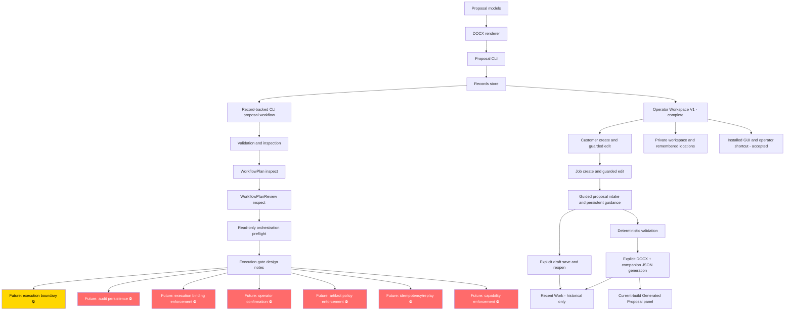

# Phoenix Office Development Progress Dashboard

> **Operator Workspace V1 is code-complete and operationally usable on Windows for the accepted proposal workflow.**
> Code baseline: PR #439 / TASK-100, `f09152917753522f8cfad7012271b71dc130feb8`.
> Manual Windows GUI and operator-created **Phoenix Office** Desktop shortcut launch acceptance was completed on 2026-09-15 and recorded in [issue #440](https://github.com/Phoenix-AI-Platform/phoenix-office/issues/440).
> Business orchestration plans remain non-executing. Supervised development workers are a separate, externally reviewed capability; continuous autopilot, automatic delivery, and desktop network/API/MCP authority remain unavailable.

---

## 1. Current Status Summary

| Capability | Status |
|---|---|
| Operator Workspace V1 | ✅ Code-complete — accepted Windows proposal workflow |
| Windows launch/productization through TASK-100 | ✅ Complete within installed Python GUI + operator-created shortcut scope |
| New private records workspace | ✅ Complete — explicit creation only |
| Private workspace preferences | ✅ Complete — database/template/output-root locations only |
| Guided proposal stages | ✅ Complete — Workspace, Customer, Job, Proposal, Review & Generate |
| Proposal draft save/reopen | ✅ Complete — explicit; reopen clears stale authority |
| Recent Work | ✅ Complete — historical/convenience only; explicit opening |
| Generated Proposal | ✅ Complete — explicit current-build authority; proposal edits invalidate stale validation/build authority |
| Persistent status, next-action guidance, stage navigation | ✅ Complete — presentation and scroll-only navigation |
| Output destination and Recent Work readability | ✅ Implemented — TASK-098/099; TASK-099 native visual evidence remains NOT_RUN |
| Customer creation | ✅ Complete — insert-only |
| Customer guarded editing | ✅ Complete — immutable ID and stale-data protection |
| Job creation | ✅ Complete — insert-only for the selected customer |
| Job guarded editing | ✅ Complete — immutable IDs, fixed customer association, stale-data protection |
| Desktop DOCX + companion JSON generation | ✅ Complete — deliberate explicit action |
| CLI proposal DOCX generation | ✅ Complete |
| Record-backed CLI proposal workflow | ✅ Complete |
| Validation / inspection CLI | ✅ Complete |
| WorkflowPlan inspect | ✅ Complete |
| WorkflowPlanReview inspect | ✅ Complete |
| Read-only orchestration preflight | ✅ Complete — non-executing |
| Supervised Codex worker edits | ✅ Implemented separately — isolated worker, reviewed successor execution, bounded Python class; external review retained |
| Orchestration execution gate design docs | 🟡 Designed / documented |
| Business orchestration execution implementation | ⛔ Not implemented |
| Business orchestration: audit persistence | ⛔ Not implemented |
| Business orchestration: plan / review binding enforcement | ⛔ Not implemented |
| Business orchestration: validation / preflight enforcement | ⛔ Not implemented |
| Business orchestration: operator confirmation enforcement | ⛔ Not implemented |
| Business orchestration: output / artifact policy enforcement | ⛔ Not implemented |

**Status key:**
- ✅ Complete — implemented, tested, merged
- 🟡 Designed / documented — design notes exist; no runtime behavior
- 🔒 Guarded / intentionally blocked — blocked pending explicit approval
- ⛔ Not implemented — not started

---

### Supported launches and acceptance limits

- Source/developer: `python -m phoenix_office.proposal_desktop`.
- Installed GUI: `phoenix-office-desktop` (target `phoenix_office.proposal_desktop:main`).
- Windows: operator-created Desktop shortcut targeting the installed GUI launcher; **Phoenix Office** successfully launched the real app per issue #440.

The original TASK-100 packaging-environment gap was followed by successful operator Windows setup/launch acceptance on 2026-09-15. This does not reclassify TASK-099's native visual check: it remains **NOT_RUN**, not visual acceptance inferred from a later launch.

Phoenix Office is not a standalone portable/frozen EXE, a packaged Windows installer, or an auto-updating application. No shortcut is created automatically. See [project state](project_state.md#supported-launch-paths-and-windows-acceptance) for the evidence distinction and operational handoff.

## 2. Capability Maturity Table

| Area | Current state | Evidence / source docs | Next likely step |
|---|---|---|---|
| Operator Workspace V1 | Code-complete — private workspace, customer/job workflow, guided proposal stages, explicit validation/build/open | PR #417, #419, #425, #427, #429, #431, #433 | Operational use within existing authority |
| Private preferences and proposal drafts | Remembered workspace locations; explicit draft save/reopen clears stale validation/build authority | PR #425, #419 | No automatic restoration of proposal authority |
| Recent Work and Generated Proposal | Historical convenience vs explicit current build; edits invalidate stale validation/build/open authority | PR #429, #431, #437 | Preserve the distinction |
| Guidance and output readability | Persistent guidance, stage navigation, clearer output names and Recent Work identity/recency | PR #433, #435, #437 | TASK-099 native visual evidence remains NOT_RUN |
| Windows launch | Installed GUI command and accepted operator-created Desktop shortcut | PR #439; issue #440 manual acceptance | Installer, frozen EXE, and updater remain future/unimplemented |
| Desktop customer records | Complete within current authority — insert-only creation and guarded editing; no delete or ID rename | `src/phoenix_office/records/`, PR #352, PR #356 | Stable within current authority |
| Desktop job records | Complete within current authority — selected-customer insert-only creation and guarded editing; no delete, ID rename, or reassignment | `src/phoenix_office/records/`, PR #354, PR #358 | Stable within current authority |
| CLI proposal generation | Complete — DOCX output from JSON records | `src/phoenix_office/renderers/`, `src/phoenix_office/generators/`, PR #2–#7 | Stable; no changes planned |
| Record storage / import / export | Complete — SQLite-backed `RecordStore` with CLI | `src/phoenix_office/records/`, `docs/development/records_cli.md`, PR #29–#41 | Stable |
| Proposal validation / inspection | Complete — `validate` and `inspect` CLI for `ProposalInput` and `RecordProposalDetails` | `docs/development/proposal_workflow_runbook.md`, PR #49–#55 | Stable |
| WorkflowPlan inspection | Complete — read-only `orchestration plan inspect` CLI | `docs/development/orchestration_inspection_cli.md`, PR #72 | Stable |
| WorkflowPlanReview inspection | Complete — read-only `orchestration review inspect` CLI | `docs/development/orchestration_inspection_cli.md`, PR #74 | Stable |
| Read-only orchestration preflight | Complete — deterministic non-executing reports and plan/review fingerprint checks | `docs/development/orchestration-preflight-json-contract.md`, PR #134–#139 | Stable; remains non-executing |
| Supervised development | Isolated worker and externally approved successor execution; bounded Python execution class | PR #362, #364, #372, #387, #389, #391, #393, #397, #399, #401 | Phoenix retains validation/publication boundaries; approval and merge remain external |
| Reviewed cycle evidence | Pure external disposition recording and advancement classification; no automatic successor selection/execution | PR #421, #423 | Evidence grants no runtime authority |
| Orchestration execution gates | Design notes and read-only preflight only — execution remains unavailable | `docs/development/orchestration_execution_readiness_checklist.md`, PR #85–#97, PR #134–#139 | No execution work authorized |
| Future execution | ⛔ Not implemented | `docs/development/orchestration_execution_command_surface_design_notes.md` | Requires all gates cleared |
| Future audit persistence | ⛔ Not implemented | `docs/development/orchestration_audit_logging_design_notes.md` | Skeleton only, when explicitly approved |
| Future API / MCP surfaces | ⛔ Not implemented | `docs/prd/ecosystem-informed-prd.md` | After execution boundary is stable |

---

## 3. Mermaid Roadmap Diagram

```mermaid
flowchart TD
    A[Proposal models] --> B[DOCX renderer]
    B --> C[Proposal CLI]
    C --> D[Records store]
    D --> E[Record-backed CLI proposal workflow]
    E --> F[Validation and inspection]

    D --> R[Operator Workspace V1 - complete]
    R --> S[Customer create and guarded edit]
    S --> T[Job create and guarded edit]
    T --> U[Guided proposal intake and persistent guidance]
    R --> X[Private workspace and remembered locations]
    U --> Y[Explicit draft save and reopen]
    U --> V[Deterministic validation]
    V --> W[Explicit DOCX + companion JSON generation]
    W --> Z[Current-build Generated Proposal panel]
    Y --> RW[Recent Work - historical only]
    W --> RW
    R --> WIN[Installed GUI and operator shortcut - accepted]

    F --> G[WorkflowPlan inspect]
    G --> H[WorkflowPlanReview inspect]
    H --> I[Read-only orchestration preflight]
    I --> J[Execution gate design notes]
    J --> K[Future: execution boundary 🔒]

    J --> L[Future: audit persistence ⛔]
    J --> M[Future: execution binding enforcement ⛔]
    J --> N[Future: operator confirmation ⛔]
    J --> O[Future: artifact policy enforcement ⛔]
    J --> P[Future: idempotency/replay ⛔]
    J --> Q[Future: capability enforcement ⛔]

    style K fill:#ffd700,color:#000
    style L fill:#ff6b6b,color:#fff
    style M fill:#ff6b6b,color:#fff
    style N fill:#ff6b6b,color:#fff
    style O fill:#ff6b6b,color:#fff
    style P fill:#ff6b6b,color:#fff
    style Q fill:#ff6b6b,color:#fff
```

> Gold (🔒) = guarded / blocked pending explicit approval.
> Red (⛔) = not implemented, no design finalized for implementation.

---

## 4. PR Milestone Timeline

| Phase | PRs | Summary |
|---|---|---|
| Foundation | #2–#7 | Proposal data model, DOCX renderer, A-1 fixture, CI workflow, proposal CLI |
| Phoenix architecture / contracts | #16–#28 | Architecture docs, Core contracts, capability registry, `TaskEnvelope`, JSON examples, PR/issue templates, read-only capability/envelope CLIs |
| Records layer | #29–#41 | `CustomerRecord`/`JobRecord` models, SQLite `RecordStore`, JSON codecs/fixtures, import/list/show/export CLI |
| Record-backed proposal workflow | #42–#59 | Record-to-`ProposalInput` adapter, compose/validate/inspect CLI, smoke tests, runbook, operator checklist, output artifact conventions, MVP acceptance doc |
| Orchestration contracts and inspection | #60–#84 | `WorkflowPlan` model + fixture, approval boundary + fixtures, project state/runbook/guardrails docs, `WorkflowPlan` inspect CLI, `WorkflowPlanReview` inspect CLI, inspection guide, CLI help/path/non-execution tests, next-brick planning guide |
| Execution readiness and guardrail docs | #85–#97 | Execution readiness checklist, 12 design-notes-only gate areas (audit, binding, preflight, confirmation, artifact policy, dry-run, result, command surface, cancellation, provenance, private data/secrets, permission/capability, idempotency/replay) |
| Verified local desktop records and proposal workflow | #347, #349–#350, #352, #354, #356, #358 | Read-only desktop foundation, controlled DOCX + companion JSON generation, real-Tk correction, insert-only customer/job creation, and guarded customer/job editing with immutable identities and stale-data protection |
| Supervised Codex autonomy milestone | Through #372 and TASK-064 | TASK-059 added durable SQLite Codex claim/control state; TASK-060 added the supervised execution-to-PR pipeline foundation; TASK-061 added deterministic safe native Windows launcher binding; TASK-062 restored authenticated model transport under a bounded sanitized environment; TASK-064 added the isolated WSL2/Linux backend using exact Codex 0.146.1, a WSL-native shadow workspace, validated patch transfer to the disposable Windows worktree, and targeted cancellation and exit proof |
| First successor-driven supervised Codex pilot | #397 / TASK-077 | Exercised a successor proposal, external approval, deterministic task-spec compilation, and one supervised docs-only runner attempt as one bounded chain. All Phoenix-owned validation gates passed, and the runner reached `pr_opened_and_stopped` and stopped for architecture review. |
| Reviewed development progression | #387, #389, #391, #393, #396, #399, #401, #404, #406, #409, #410 | Bounded packages, reviewed successor proposal/compilation/execution, Python class, and worker hardening; no continuous autopilot |
| Private workspace and interruption recovery | #417, #419 | Explicit new database creation and proposal draft save/reopen |
| Reviewed cycle observations | #421, #423 | External PR disposition and next-cycle evidence only; no successor selection or execution authority |
| Operator Workspace V1 | #425, #427, #429, #431 | Private preferences, guided stages, Recent Work, current-build Generated Proposal panel |
| V1 guidance and readability | #433, #435, #437 | Persistent guidance/stage navigation, output destination clarity, Recent Work identity/recency; TASK-099 visual evidence NOT_RUN |
| Windows launch productization | #439 / TASK-100 | Existing desktop main exposed as installed GUI entry point; later manual app/shortcut acceptance recorded in issue #440, not a new code capability |

---

## 5. Current Guardrails

The accepted desktop and separately supervised development paths retain these boundaries. Business-orchestration execution/enforcement remains unimplemented:

- **Planning and approval contracts are non-executing.** They describe and record decisions; they do not trigger any action.
- **Phoenix Office cannot execute orchestration plans.** No execution path exists.
- **The supervised Codex worker is not orchestration execution.** Native Windows `workspace-write` remains unsuitable on the current qualified path, so Phoenix uses WSL2 for supervised worker edits.
- **Codex has no branch, commit, push, PR, approval, or merge authority.** Phoenix owns validation, commit, push, PR creation, review, and merge boundaries.
- **There are no automatic retries, background resume, or autonomous merge authority.**
- **The TASK-077 successor proposal required external approval.** It did not provide autonomous approval, autonomous issue authoring, autonomous merge, retry authority, background execution, or continuous looping.
- **The TASK-077 worker authority was docs-only and bounded to the reviewed task specification.** It did not broaden worker authority.
- **No automatic proposal generation from orchestration plans exists.**
- **The desktop remains local-first and operator-driven.** No automatic validation, generation, artifact opening, sending/delivery, background execution, network/API/MCP authority, or autonomous business actions.
- **Recent Work is historical/convenience only.** It never grants current-build authority; Generated Proposal derives from the current build and proposal-affecting edits invalidate stale validation/build authority.
- **Desktop record authority is create/update only.** Customer/job deletion, identity rename, and job customer reassignment are unavailable.
- **New private workspace initialization is explicit only.** Migration and schema changes remain unavailable.
- **Draft save/reopen is explicit and clears stale authority.** Automatic reopen and historical revision management are unavailable.
- **No business-orchestration audit persistence exists.** Supervised development claim/control evidence is separate.
- **No plan / review binding enforcement exists.**
- **No validation / preflight enforcement exists.**
- **No operator confirmation enforcement exists.**
- **No output / artifact policy enforcement exists.**
- **No dry-run / no-write enforcement exists.**
- **No execution result reporting exists.**
- **Orchestration cancellation or rollback behavior does not exist.** The supervised Codex worker path has targeted cancellation and exit proof only.
- **No input provenance enforcement exists.**
- **No private-data / secrets enforcement exists.**
- **No permission / capability enforcement exists.**
- **No idempotency / replay behavior exists.**

---

## 6. Next Work Lanes

### Lane A — operational use and documentation

- [x] Operator Workspace V1 and Windows installed-GUI/shortcut launch acceptance
- [x] Progress dashboard (this document)
- [x] Project state/dashboard reconciled through PR #439 / TASK-100 and the later Windows operational acceptance recorded in issue #440
- [ ] Documentation cleanup and navigation updates when explicitly scoped
- [ ] Project state updates after future merged PRs

### Lane B — future validation (separately scoped)

- [ ] Unsupported command-surface guard tests for new gate areas
- [ ] Path / error handling tests for edge cases
- [ ] Additional read-only preflight contract tests only when explicitly scoped

### Lane C — future implementation (unauthorized here)

- [ ] Standalone/frozen distribution, Windows installer, and auto-update are not implemented
- [ ] Continuous autopilot and business orchestration/API/MCP execution remain gated
- [ ] No implementation task is selected or authorized by this dashboard update
- [ ] Any future implementation requires a separate scoped task and review

> ⚠️ **Lane B and Lane C should not be started without explicit scoped approval.** Do not implement, automate, or enforce anything in these lanes without a dedicated task prompt.
